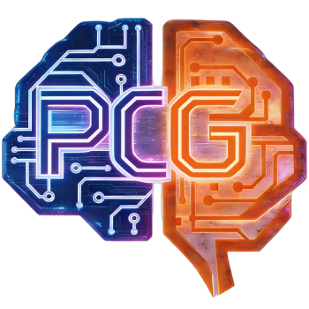

<div align="center">
  

  # AI Prompt Chain Generator

**Version:** 0.2.0
**License:** MIT

**Date:** January 24, 2026 **Status:** ✅ Ready for Testing

</div>

---

## 📑 Table of Contents

- [Purpose](#purpose)
- [Current Structure](#current-structure)
- [Templates](TEMPLATES.md) 📄
- [Usage](#usage)
- [How It Works](#how-it-works)
- [Formula](#formula)
- [Key Features](#key-features)
- [Progress Status](#progress-status)
- [Documentation](#documentation)
- [Prerequisites](#prerequisites)
- [Examples](#examples)
- [Contributing](#contributing)
- [License](#license)
- [Author](#author)
- [Acknowledgments](#acknowledgments)
- [Support](#support)

---

## Purpose

Automated prompt chain system for generating project-specific AI instructions:
- **Single projects** - BASE templates + project analysis → `.github/copilot-instructions.md`
- **Multi-project setups** - Shared docs + cross-project workflows + sync automation

---

## Current Structure

```
ai-prompt-chain-generator/
├── README.md                         ← This file
├── chains/                           ← ✅ COMPLETED
│   ├── 0-detect-setup.md             ← Detect single/multi-project
│   ├── 1-determine-techstack.md      ← Analyze tech stack
│   ├── 2-categorize-files.md         ← Categorize by purpose (adaptive)
│   ├── 3-identify-architecture.md    ← Identify patterns (universal)
│   ├── 4-domain-deep-dive.md         ← Domain analysis (language-agnostic)
│   ├── 5-styleguide-generation.md    ← Extract code style (descriptive)
│   ├── 6-dependency-audit.md         ← Dependency health & security audit
│   └── 7-build-instructions.md       ← Build final instructions
├── templates/                        ← ✅ COMPLETED
│   ├── base/
│   │   ├── universal-rules.md        ← Core rules for ALL projects
│   │   ├── spec-driven-development.md ← Feature spec workflow
│   │   └── languages/                ← Language-specific patterns
│   │       ├── nodejs-patterns.md    ← Node.js/JavaScript/TypeScript
│   │       ├── python-patterns.md    ← Python/Flask/Django/FastAPI
│   │       ├── csharp-patterns.md    ← C#/.NET/ASP.NET Core
│   │       ├── bash-patterns.md      ← Bash/Shell scripts
│   │       └── generic-patterns.md   ← Fallback for other languages
│   ├── multi-project/
│   │   ├── sync-workflow.md          ← Cross-project sync process
│   │   ├── adaptation-patterns.md    ← COPY/ADAPT/SKIP patterns
│   │   └── sync-status-tracker.md    ← Sync progress tracking
│   └── specs/
│       ├── feature-spec-single.md    ← Single project feature template
│       └── cross-project-spec.md     ← Multi-project sync template
```

📖 **For detailed templates documentation, see [TEMPLATES.md](TEMPLATES.md)**

---

## Usage

### 🆕 For New Projects (First Time Use)

Use this when generating AI instructions for your project for the first time.

**Main Prompt (Copy & Paste to AI Agent)**

> **⚠️ IMPORTANT:** Edit these values BEFORE running the prompt:
> - **Choose ONE scenario:** Keep only single-project OR multi-project line (delete the other)
> - Replace `["~/my-project"]` with your actual project path
>   - For current directory: `["."]`
>   - For absolute path: `["~/projects/app"]` or `["D:/MyProjects/app"]`
>   - For relative path: `["../other-project"]`
> - For multi-project: Replace `["~/project-a", "~/project-b"]` with your actual project paths
> - Adjust `{output_folder}` if needed (default: `.results`)
> - Set `{shared_docs_path}` for multi-project setups

```
{output_folder} = .results
{final_output_file} = .github/copilot-instructions.md
{project_folders} = ["~/my-project"]  # Single project - REPLACE with your path!
# OR
{project_folders} = ["~/project-a", "~/project-b"]  # Multi-project - REPLACE with your paths!
{shared_docs_path} = ~/.shared-docs  # For multi-project only

You are assisting with generating AI coding instructions using a multi-step prompt chain.

1. Read all prompt files from GitHub:
   https://github.com/ale4ko69/ai-prompt-chain-generator/tree/main/chains/

2. Review all prompt files (0-7) in the chains/ folder.

3. Review all prompt files (0-7) WITHOUT executing them.
   - This will help you understand the full scope of the prompt chain.

4. Confirm you have a full understanding of the chain sequence.

5. Once familiar with the flow, execute prompts in numerical order:
   - 0-detect-setup.md          (Detect single vs multi-project)
   - 1-determine-techstack.md    (Analyze tech stack)
   - 2-categorize-files.md       (Categorize files by purpose)
   - 3-identify-architecture.md  (Identify patterns)
   - 4-domain-deep-dive.md       (Understand domain logic)
   - 5-styleguide-generation.md  (Extract code style)
   - 6-dependency-audit.md       (Check dependency health & security)
   - 7-build-instructions.md     (Generate final file)

6. For each step, output results to `{output_folder}/`:
   - Example: 1-determine-techstack.md → {output_folder}/1-techstack.md

7. Use BASE templates from `templates/` folder:
   - templates/base/universal-rules.md
   - templates/base/spec-driven-development.md
   - templates/base/languages/{detected-language}-patterns.md (from Step 1)
   - templates/multi-project/* (if multi-project detected)

8. Final output location:
   - Single project: {final_output_file}
   - Multi-project: {shared_docs_path}/*.md + per-project {final_output_file}

9. IMPORTANT: If {final_output_file} exists, create backup first:
   - Backup: {final_output_file}.backup-YYYY-MM-DD-HHmmss.md
   - Notify user about backup creation

Stop ONLY when:
- All steps (0-7) are complete
- All BASE templates are integrated
- Full {final_output_file} is generated
- User is notified of completion
```

---

### 🔄 For Updating Existing Projects

**If you're already using AI Prompt Chain Generator and want to update to the latest version:**

**⚠️ CRITICAL:** Do NOT re-run the main prompt above! You'll lose all your customizations.

📖 **Follow our safe migration guide:** [UPDATE-INSTRUCTIONS.md](UPDATE-INSTRUCTIONS.md)

**🚀 First-time updating from pre-0.2.0?** Start with the "First-Time Update" section to enable automatic update detection.

**The migration guide covers:**
- ✅ First-time setup: Enable auto-update detection (for pre-0.2.0 projects)
- ✅ Automatic backup creation
- ✅ Preserving your custom rules and modifications
- ✅ Safely merging new template improvements
- ✅ Handling file renames (Step 6 → Step 7)
- ✅ Version tracking and rollback instructions
- ✅ Cross-platform support (Windows & Unix/Linux/macOS)

**Why use the migration guide?**
- Prevents accidental overwrites of your customized instructions
- Ensures smooth integration of new features (e.g., Step 6 dependency audit, auto-update detection)
- Maintains project-specific rules you've added
- Provides rollback if something goes wrong


---

## How It Works

### Single Project Mode

```
Input: {project_folder}

Step 0: Detect single-project setup
Steps 1-5: Analyze project (tech stack, architecture, domain, style)
Step 6: Audit dependencies (security, outdated packages)
Step 7: Combine BASE templates + analysis → .github/copilot-instructions.md
        + Generate .ai-prompt-chain-generator.json (version tracking)

Backup: If file exists → .github/copilot-instructions.backup-YYYY-MM-DD-HHmmss.md

AI Assistant: Automatically checks for updates once per day
              Notifies if new version available
              Directs to UPDATE-INSTRUCTIONS.md if customizations detected
```

---

### Multi-Project Mode

```
Input: {project_folders} (multiple), {shared_docs_path}

Step 0: Detect multi-project setup

Create shared docs:
  ~/.shared-docs/global-rules.md (from universal-rules.md)
  ~/.shared-docs/using-existing-code.md (from CRITICAL template)
  ~/.shared-docs/sync-workflow.md (from sync-workflow.md)
  ~/.shared-docs/adaptation-patterns.md (from adaptation-patterns.md)

Steps 1-5: Analyze each project
Step 6: Audit dependencies for each project

Step 7: Create project-specific instructions
  project1/.github/copilot-instructions.md
    → Links to ~/.shared-docs/
    → Project-specific overrides (from analysis)
    → Dependency maintenance schedule
  project1/.ai-prompt-chain-generator.json (version tracking)

  project2/.github/copilot-instructions.md
    → Links to ~/.shared-docs/
    → Project-specific overrides (from analysis)
    → Dependency maintenance schedule
  project2/.ai-prompt-chain-generator.json (version tracking)

  ~/.shared-docs/.ai-prompt-chain-generator.json (global version tracking)

AI Assistant: Checks version files for each project
              Notifies about updates individually per project
              Safe migration for customized projects
```

---

## Formula

### Single Project:
```
BASE universal-rules.md
  + Chain analysis (steps 1-6)
  + Dependency health check
  + Project-specific patterns
  ↓
.github/copilot-instructions.md
```

### Multi-Project:
```
BASE templates → ~/.shared-docs/
  ├─ global-rules.md
  ├─ using-existing-code.md
  ├─ sync-workflow.md
  └─ adaptation-patterns.md

Chain analysis (per project) → project/.github/copilot-instructions.md
  ├─ Links to shared docs
  ├─ Dependency maintenance schedule
  └─ Project-specific overrides
```

---

## Key Features

1. ✅ **Multi-Project Support** - First public example for interconnected projects
2. ✅ **COPY vs ADAPT Patterns** - Catalog of cross-project adaptations
3. ✅ **USER DECIDES Principle** - Explicit approval workflows
4. ✅ **Critical Rules** - Anti-pattern prevention and NEVER invent APIs policy
5. ✅ **Cross-Project Commands** - 40+ ready terminal commands
6. ✅ **File Mapping Tables** - Structured sync decision-making
7. ✅ **Language Flexibility** - English responses by default (customizable)
8. ✅ **8-Step Analysis Chain** - Tech stack, architecture, domain, style, dependencies
9. ✅ **Dependency Audit** - Security vulnerabilities, outdated packages, maintenance schedule
10. ✅ **Spec-Driven Development** - Feature specs with TODO tracking
11. ✅ **Automated Sync Workflow** - File mapping with confidence levels
12. ✅ **Monorepo Support** - Multi-workspace dependency management
13. ✅ **Version Tracking** - Auto-detects updates, preserves customizations, safe migration workflow

---

## Progress Status

### ✅ Completed

- [x] Analyzed existing documentation (8 files)
- [x] Separated UNIVERSAL vs PROJECT-SPECIFIC rules
- [x] Created BASE templates (2 files)
- [x] Created MULTI-PROJECT templates (3 files)
- [x] Created SPEC templates (2 files)
- [x] Created LANGUAGE templates (5 files: Node.js, Python, C#, Bash, Generic)
- [x] Created prompt chains (8 files: steps 0-7)
- [x] Added dependency audit step (security, outdated packages, monorepo support)
- [x] Documented template structure


## Prerequisites

- AI coding assistant (GitHub Copilot, Claude, ChatGPT, etc.)
- Access to project files you want to analyze
- Basic understanding of your project's structure

---

## Examples

### Single Project Example
```
{project_folders} = ["~/projects/my-web-app"]
```

### Multi-Project Example
```
{project_folders} = ["~/projects/backend-api", "~/projects/frontend-app"]
{shared_docs_path} = ~/.shared-docs
```

---

## Contributing

Contributions are welcome! Please:
1. Fork the repository
2. Create a feature branch
3. Test your changes
4. Submit a pull request

See [CONTRIBUTING.md](CONTRIBUTING.md) for detailed guidelines (coming soon).

---

## License

This project is licensed under the **MIT License**.

```
MIT License

Copyright (c) 2026 ale4ko69

Permission is hereby granted, free of charge, to any person obtaining a copy
of this software and associated documentation files (the "Software"), to deal
in the Software without restriction, including without limitation the rights
to use, copy, modify, merge, publish, distribute, sublicense, and/or sell
copies of the Software, and to permit persons to whom the Software is
furnished to do so, subject to the following conditions:

The above copyright notice and this permission notice shall be included in all
copies or substantial portions of the Software.

THE SOFTWARE IS PROVIDED "AS IS", WITHOUT WARRANTY OF ANY KIND, EXPRESS OR
IMPLIED, INCLUDING BUT NOT LIMITED TO THE WARRANTIES OF MERCHANTABILITY,
FITNESS FOR A PARTICULAR PURPOSE AND NONINFRINGEMENT. IN NO EVENT SHALL THE
AUTHORS OR COPYRIGHT HOLDERS BE LIABLE FOR ANY CLAIM, DAMAGES OR OTHER
LIABILITY, WHETHER IN AN ACTION OF CONTRACT, TORT OR OTHERWISE, ARISING FROM,
OUT OF OR IN CONNECTION WITH THE SOFTWARE OR THE USE OR OTHER DEALINGS IN THE
SOFTWARE.
```

---

## Author

**ale4ko69** - Initial work and maintenance

- GitHub: [@ale4ko69](https://github.com/ale4ko69)
- Repository: [ai-prompt-chain-generator](https://github.com/ale4ko69/ai-prompt-chain-generator)

---

## Acknowledgments

- Inspired by real-world multi-project development challenges
- Built for improving AI-assisted development workflows
- Community feedback and contributions welcome

---

## Support

- 📖 [Documentation](README.md)
- 🐛 [Issues](https://github.com/ale4ko69/ai-prompt-chain-generator/issues)
- 💬 [Discussions](https://github.com/ale4ko69/ai-prompt-chain-generator/discussions)

---

**Last Updated:** 2026-01-24
**Version:** 0.2.0 (Ready for Testing)
